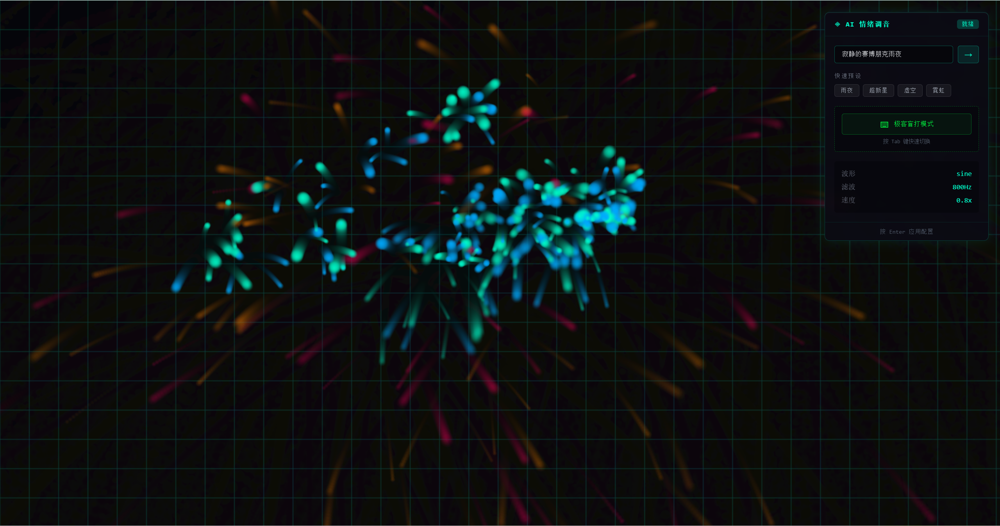

# Cyber-Synth AI 🎹✨

> 开源赛博声光乐器 - 用鼠标和键盘演奏霓虹音符

一个结合视觉粒子系统与音频合成器的互动艺术项目。移动鼠标创造霓虹粒子瀑布，敲击键盘释放矩阵代码雨，体验赛博朋克风格的视听盛宴。


## ✨ 特性

- **🖱️ 鼠标粒子系统** - 移动鼠标生成霓虹渐变粒子，带有物理重力、速度和 2 秒淡出效果
- **🎵 实时音频合成** - 基于 Tone.js 的复音合成器，X 坐标映射五声音阶，Y 坐标映射音量
- **🧠 AI 情绪调音** - 输入文字描述，自动切换音色和视觉风格
- **⌨️ 极客盲打模式** - 疯狂敲击键盘释放矩阵代码雨，配合动态节拍系统

## 🚀 快速开始

### 环境要求

- Node.js 18+
- npm 或 pnpm

### 安装与运行

```bash
# 克隆仓库
git clone https://github.com/your-username/cyber-synth-ai.git
cd cyber-synth-ai

# 安装依赖
npm install

# 启动开发服务器
npm run dev
```

打开浏览器访问 `http://localhost:5173/`，点击画布激活音频，开始演奏！

### 构建生产版本

```bash
npm run build
npm run preview
```

### 效果显示


## 🎮 玩法指南

### 基础演奏

1. **点击画布** - 激活浏览器音频上下文
2. **移动鼠标** - 在画布上绘制霓虹粒子轨迹
   - 水平移动改变音高（C3-C6 五声音阶）
   - 垂直移动改变音量
3. **享受视听** - 观察粒子拖尾和网格背景

### AI 情绪调音


在右上角控制面板中：

- **输入描述** - 输入如"寂静的赛博朋克雨夜"、"炽热的超新星爆发"
- **快速预设** - 点击预设按钮快速切换风格
- **参数显示** - 实时查看当前波形、滤波频率、粒子速度

| 预设 | 波形 | 色调 | 速度 | 氛围 |
|------|------|------|------|------|
| 雨夜 | sine | 青色 | 慢 | 寂静冷冽 |
| 超新星 | sawtooth | 粉红 | 快 | 炽热爆发 |
| 虚空 | triangle | 紫色 | 极慢 | 深邃空灵 |
| 霓虹 | square | 橙青 | 中速 | 都市夜色 |

### 极客盲打模式


按下 **Tab** 键或点击"极客盲打模式"按钮进入：

1. **疯狂敲击键盘** - 在鼠标位置炸裂出矩阵代码字符
2. **动态节拍系统**（120 BPM）：
   - 敲击速度 > 3次/秒：加入 Hi-Hat 擦片
   - 敲击速度 > 5次/秒：加入 Lead 主音旋律
3. **停止 2 秒后** - 旋律自动淡出，只剩底鼓
4. **按 Tab 退出** - 回到普通演奏模式

## 🛠️ 技术栈

- **[Vue 3](https://vuejs.org/)** - Composition API + `<script setup>`
- **[TypeScript](https://www.typescriptlang.org/)** - 类型安全
- **[Vite](https://vitejs.dev/)** - 极速开发构建
- **[Tone.js](https://tonejs.github.io/)** - Web Audio API 合成器
- **HTML5 Canvas** - 粒子渲染引擎

## 📁 项目结构

```
cyber-synth-ai/
├── src/
│   ├── components/
│   │   ├── CyberCanvas.vue    # Canvas 粒子系统 + 音频合成
│   │   └── ControlPanel.vue   # FUI 风格控制面板
│   ├── composables/
│   │   └── useAIConfig.ts     # AI 情绪配置解析
│   ├── App.vue
│   ├── main.ts
│   └── style.css
├── public/
│   ├── favicon.svg
│   └── icons.svg
└── package.json
```

## 🎨 自定义

### 添加新的情绪预设

编辑 `src/composables/useAIConfig.ts`：

```typescript
const PRESETS: Record<string, AIConfig> = {
  // 添加你的预设
  ocean: {
    oscillatorType: 'sine',
    filterFrequency: 600,
    colorPalette: [180, 220],  // HSL 色调
    particleSpeed: 0.6,
    reverbWet: 0.7,
    mood: '深海蓝调'
  }
}

// 添加关键词映射
const KEYWORDS: Record<string, string> = {
  '海': 'ocean',
  '波': 'ocean',
  // ...
}
```

### 修改音频参数

在 `CyberCanvas.vue` 中调整：

```typescript
Tone.Transport.bpm.value = 120  // 节拍速度
const NOTE_PROBABILITY = 0.15   // 音符触发概率
const GRAVITY = 0.05            // 粒子重力
```

## 📄 License

MIT License - 自由使用、修改和分发

## 🙏 致谢

- [Tone.js](https://tonejs.github.io/) - 优雅的 Web Audio 框架
- [Vue.js](https://vuejs.org/) - 渐进式 JavaScript 框架
- 所有赛博朋克艺术家的灵感

---

**用代码演奏，让音符可视化** 🎹✨
